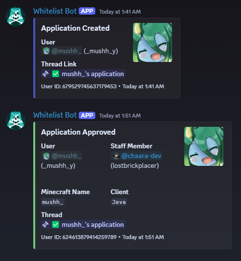
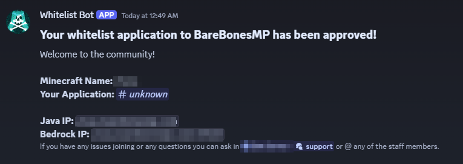
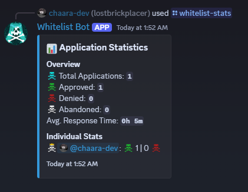
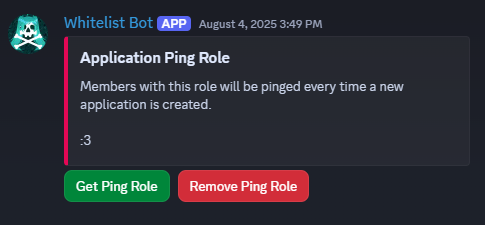

<!-- ## [[Invite Bot]](https://discord.com/oauth2/authorize?client_id=1397280746946822354&permissions=1496930446352&integration_type=0&scope=applications.commands+bot) -->

<div align="center">
    <h1>BareBones Whitelist Bot</h1>
</div>


# Overview
Whitelist Bot is a single purpose discord bot built using [discord.py](https://github.com/Rapptz/discord.py) and for use with whitelisted Minecraft Servers. It manages new applications to the server and integrates with other existing bots to automatically add users to the whitelist when they are accepted. It keeps a database of current and past applications by logging all application activity to a #logs channel as well as using a SQLite3 database (not provided).

# Details:
### 💻 Slash Commands
- `/approve` -> Approves an applicant, sends whitelist command, DMs applicant, and assigns the Member role.
- `/deny` -> Denies an applicant, and DMs them with the reason for denial.
- `/quick-approve` -> Approves an applicant and assigns the Member role. Does not need to be used in an application channel.
- `/whitelist-stats` -> Displays staff application stats with how many each member has approved/denied and average response time.
- `update-whitelist-message` -> Updates the embedded whitelist rules and information message. Can be reset to default any time.

### 💭 Features
- Automatically closes application threads when they're abandonded (after 6 hours or after leaving the server).
- Logs all application activity to a dedicated logs channel with details (created/abandoned/accepted/denied)
- Can assign staff a role to get automatically pinged when an application is created
- Integrates with Discord Chat Console Command bots
- Assigns Member role on completed application, prevents re-application after being accepted, or multiple open applications at once

### 📷 Images


</br>




### 💾 Using the bot


</br>
</br>

<details> 
    <summary style="font-size:150%;font-weight: bold;">📃 To-do list</summary>
    A list of features, bugs and planned additions to the bot.

```diff
+ GREEN: IMPLEMENTED -> MAY BE UPDATED IN FUTURE
- RED: UNIMPLEMENTED -> PLANNED FOR FUTURE
! YELLOW: ON HOLD | MAY NOT BE IMPLEMENTED | IN PROGRESS

════════════════════════════════════════════════════════════════════════════════════════════════════

+ disallow members to apply

+ edit old embed application message when bot start

- add try/except methods to things that can break
-   log errors to files with timestamps

+ don't let people with open applications apply again 

+ add way to whitelist people with no application thread ('/quick-apply')

+ add statistics for each staff member that has accepted/denied and average time

+ send whitelist commands to #mc-chat

+ add ping role for 'available to accept'

+ split various functions into smaller or more generalized functions [WIP]
+   also do the same for the '/approve' and '/deny' commands -> remove lots of duplicate code

+ Add some way to update the whitelist_message.txt from a command without needing to directly access the file

+ DM applicant with details when accepted/denied

+ custom profile picture/banner

! ability to set which channels are which with a slash command "/set-channel type=app/logs/get-role/etc, id=#channel-id"
!   change currently hard-coded role and channel IDs
!   would involve changing database structures -> not going to do it until more time

+ automatically close thread and mark as abandoned if user leaves server

+ format README.md as a proper readme to prepare for publish on github

! Member.is_on_mobile() check for sending different (copy-pastable) whitelist application message [unlikely to be done]

- move emoji markdown to system.py

+ remind applicant to fill out form

- add slash command param descriptions

- slash commands to view recent applications for each staff member

- command to list all applicants in filtered time (X in past week/month/20d/etc, usernames and thread links in bullets)
```
</details>